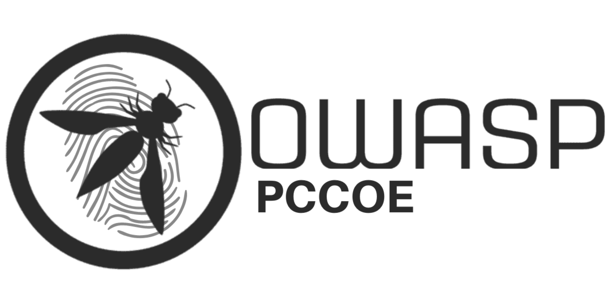

## Welcome

OWASP Student Chapter of Pimpri Chinchwad College of Engineering(Pccoe), Pune. We at OWASP PCCOE aims to solving problems, especially when it comes to making the digital world safer.We've done cool stuff like organizing exciting hackathons, tech talks and workshops, all aimed at creating a fun and lively coding community on our campus. Join us, and let's learn together and make the internet a safer place! 🚀

## Participation

All events conducted by OWASP PCCOE are free and open to anyone interested. To participate in our upcoming events, please refer to <a href="/www-chapter-pimpri-chinchwad-college-of-engineering#div-upcoming" onclick="location.hash='div-upcoming'; location.reload();">Upcoming Events</a>. An archive of our past events is available <a href="/www-chapter-pimpri-chinchwad-college-of-engineering#div-past" onclick="location.hash='div-past'; location.reload();">here</a>.

## Call for Speakers

Call For Speakers is open. If you would like to present a talk on Application Security at future OWASP PCCOE Chapter events - please review and agree with the [OWASP Speaker Agreement](https://owasp.org/www-policy/legal/speaker-agreement) and send the proposed talk title, abstract and speaker bio to the Chapter Leaders (refer sidebar) via e-mail.

## Community

You can join our [Meetup group](#) to get updates about our upcoming events. You can also join our [Discord server](https://discord.gg/93GpqSdQ) and our channel on [OWASP's Slack](https://owasp.slack.com/) for discussions relevant to application security and the working of this chapter.

We also encourage you to [become a member](https://owasp.org/membership/) or consider a [donation](https://owasp.org/donate/) to support OWASP's ongoing work.

## Next Meeting/Event

No events currently scheduled
